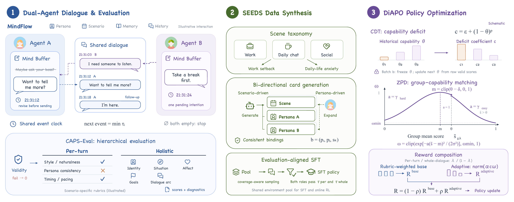

# AnthroDial Benchmark

Code for evaluating human-like dialogue, with historical results for the Everyday Chat, Long-Horizon Character, and Game Interaction datasets using **Qwen3.5-397B-A17B as the judge**.

**Website:** [https://chubbyai.github.io/AnthroDial/](https://chubbyai.github.io/AnthroDial/)



*Figure 2. Overview of the AnthroDial framework.*

## Results

| Dataset | Models | Scenarios per model | Evaluated cases per model | Results |
| --- | ---: | ---: | ---: | --- |
| Everyday Chat | 7 | 50 | 100 | [Leaderboard](results/chatbot/leaderboard.md) |
| Long-Horizon Character | 7 | 50 | 100 | [Leaderboard](results/clam/leaderboard.md) |
| Game Interaction | 7 | 59 | 118 | [Leaderboard](results/game/leaderboard.md) |

Each scenario evaluates both participant roles. The leaderboards contain model evaluation results only.

**Metrics:** All three datasets report the same seven models from Table 1 of the paper, preserving the model names, row order, and values. Metrics include `Score`, `Per-Turn`, `Holistic`, `ACC@85`, `ACC@90`, and `ACC@95`, all on a 0–1 scale with four decimal places. See the [result notes](docs/RESULTS.md) for details.

## Installation and Usage

Use Python 3.10 or later. Run the following commands from the repository root:

```bash
python -m venv .venv
source .venv/bin/activate
python -m pip install -r requirements.txt
python apps/benchmark/scripts/run_benchmark.py --help
```

Prepare persona cards, scenario cards, and bindings as described in the [input data guide](docs/INPUTS.md). Then edit the YAML files under `configs/<task>/` to set `llm.base_url` and each `llm.model_configs.*.base_url` to your OpenAI-compatible service endpoints. The provided addresses are local service placeholders; model deployment names must also match those exposed by your services.

```bash
export OPENAI_API_KEY='your-model-api-key'
export JUDGE_API_KEY='your-judge-api-key'

python apps/benchmark/scripts/run_benchmark.py \
  --config configs/chatbot/qwen3.5-397b-a17b.yaml
```

For Game Interaction and Long-Horizon Character, use `configs/game/qwen3.5-397b-a17b.yaml` and `configs/clam/qwen3.5-397b-a17b.yaml`, respectively. These deployment templates retain the generation and evaluation parameters from the source snapshot, with service endpoints, credentials, and output paths replaced. They do not guarantee reproduction of historical API responses.

New runs write to `runs/<task>/` and do not overwrite the published snapshots in `results/`. `.env.example` documents the environment variables; the program does not automatically load `.env` files.

## Repository Structure

```text
apps/benchmark/      Evaluation, rescoring, aggregation, human baseline evaluation, and tests
libs/                Shared dialogue, configuration, LLM interface, and scoring code
configs/             Configuration templates for the three datasets with the 397B judge
data/*/rubric.yaml   Scoring rubrics; evaluation data is not included
src/chat/prompts/    Dialogue generation and baseline prompts
results/             Markdown leaderboards for the three datasets
docs/                Metric definitions, input formats, and release scope
```

## License

[MIT](LICENSE). This license does not cover data that is not distributed with this repository or external model weights.
